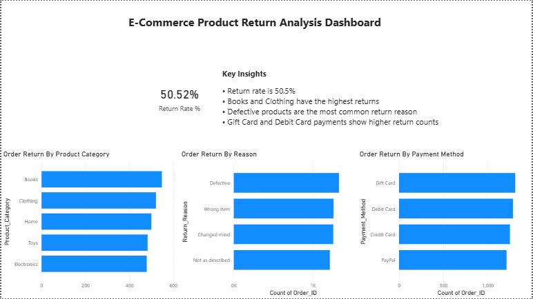

# E-Commerce Product Return Analysis

## Project Overview
This project analyzes product return patterns in an e-commerce dataset using **SQL and Power BI**.  
The goal is to identify key factors contributing to product returns and provide insights that could help improve product quality, logistics, and customer satisfaction.

---

## Tools Used
- SQL (MySQL Workbench)
- Power BI
- Excel
- Pivot Tables
- Data Cleaning
- Data Visualization

---

## Dataset
The dataset includes the following key columns:

- Order_ID
- Product_Category
- Product_Price
- Payment_Method
- Shipping_Method
- Return_Reason
- Return_Status
- Return_Days
- User_Age
- User_Gender

---

## KPI

**Return Rate**

Total records analyzed: **50.52**%

---

## Key Insights

- Books and Clothing categories show the highest return counts compared to other product categories.
- Defective products are the most common reason for returns, followed by incorrect items.
- Orders paid using Gift Card and Debit Card methods show higher return counts.

---

## SQL Analysis
SQL queries were used to analyze the dataset and generate insights.

Key analysis performed:

- Total number of orders
- Return rate calculation
- Returns by product category
- Returns by return reason
- Returns by payment method

---

## Dashboard

- The dashboard highlights return trends across product categories, payment methods, and return reasons.
- It provides insights into high-return products and helps identify operational issues affecting product returns.

---

## Business Recommendations

- Improve product quality control to reduce defective product returns.
- Enhance product descriptions and verification to reduce wrong-item deliveries.
- Monitor product categories with high return rates to improve product performance.
